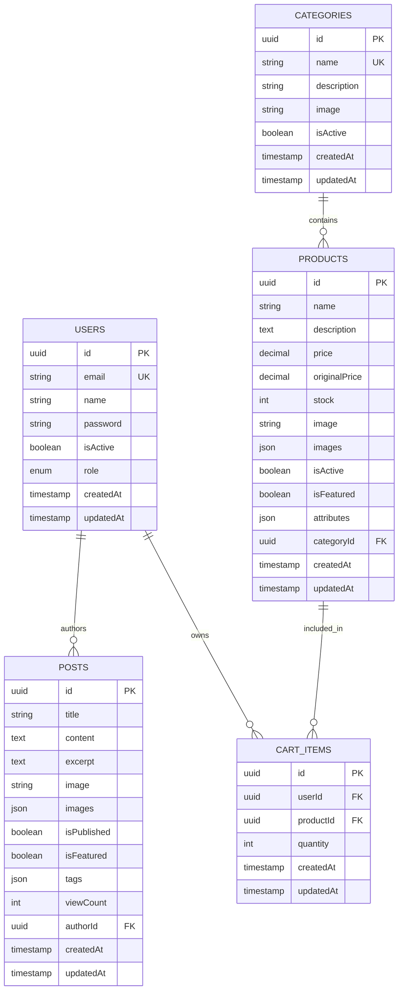

# Fresh Shop API - Database Schema Documentation

## 🗄️ Database Overview

Fresh Shop API uses PostgreSQL as the primary database with TypeORM as the Object-Relational Mapping (ORM) tool. The database is hosted on Neon (cloud PostgreSQL service) and includes Redis caching for performance optimization.

### Database Configuration

- **Type**: PostgreSQL
- **Host**: Neon Cloud Service
- **SSL**: Enabled for production
- **Connection Pooling**: Managed by TypeORM
- **Synchronization**: Auto-sync in development, manual migrations in production

## 📊 Entity Relationships



## 🏗️ Table Structures

### Users Table (`users`)

Stores user account information and authentication data.

| Column      | Type      | Constraints        | Description                |
| ----------- | --------- | ------------------ | -------------------------- |
| `id`        | UUID      | PRIMARY KEY        | Unique user identifier     |
| `email`     | VARCHAR   | UNIQUE, NOT NULL   | User email address         |
| `name`      | VARCHAR   | NOT NULL           | User display name          |
| `password`  | VARCHAR   | NOT NULL           | Hashed password (bcrypt)   |
| `isActive`  | BOOLEAN   | DEFAULT true       | Account status             |
| `role`      | ENUM      | DEFAULT 'customer' | User role (admin/customer) |
| `createdAt` | TIMESTAMP | NOT NULL           | Account creation time      |
| `updatedAt` | TIMESTAMP | NOT NULL           | Last update time           |

**Indexes:**

- Primary key on `id`
- Unique index on `email`
- Index on `role` for role-based queries

**Relationships:**

- One-to-Many with `posts` (lazy loaded)
- One-to-Many with `cart_items` (lazy loaded)

### Categories Table (`categories`)

Stores product categories for organization.

| Column        | Type      | Constraints      | Description                |
| ------------- | --------- | ---------------- | -------------------------- |
| `id`          | UUID      | PRIMARY KEY      | Unique category identifier |
| `name`        | VARCHAR   | UNIQUE, NOT NULL | Category name              |
| `description` | TEXT      | NULLABLE         | Category description       |
| `image`       | VARCHAR   | NULLABLE         | Category image URL         |
| `isActive`    | BOOLEAN   | DEFAULT true     | Category status            |
| `createdAt`   | TIMESTAMP | NOT NULL         | Creation time              |
| `updatedAt`   | TIMESTAMP | NOT NULL         | Last update time           |

**Indexes:**

- Primary key on `id`
- Unique index on `name`
- Index on `isActive` for filtering

**Relationships:**

- One-to-Many with `products` (lazy loaded)

### Products Table (`products`)

Stores product information and inventory data.

| Column          | Type          | Constraints   | Description                            |
| --------------- | ------------- | ------------- | -------------------------------------- |
| `id`            | UUID          | PRIMARY KEY   | Unique product identifier              |
| `name`          | VARCHAR       | NOT NULL      | Product name                           |
| `description`   | TEXT          | NULLABLE      | Product description                    |
| `price`         | DECIMAL(10,2) | NOT NULL      | Current selling price                  |
| `originalPrice` | DECIMAL(10,2) | NULLABLE      | Original price (for discounts)         |
| `stock`         | INTEGER       | DEFAULT 0     | Available inventory                    |
| `image`         | VARCHAR       | NULLABLE      | Primary product image                  |
| `images`        | JSON          | NULLABLE      | Additional product images              |
| `isActive`      | BOOLEAN       | DEFAULT true  | Product availability                   |
| `isFeatured`    | BOOLEAN       | DEFAULT false | Featured product flag                  |
| `attributes`    | JSON          | NULLABLE      | Product attributes (color, size, etc.) |
| `categoryId`    | UUID          | NOT NULL      | Foreign key to categories              |
| `createdAt`     | TIMESTAMP     | NOT NULL      | Creation time                          |
| `updatedAt`     | TIMESTAMP     | NOT NULL      | Last update time                       |

**Indexes:**

- Primary key on `id`
- Foreign key index on `categoryId`
- Index on `isActive` for filtering
- Index on `isFeatured` for featured products
- Index on `price` for sorting
- Composite index on `(categoryId, isActive)` for category filtering

**Relationships:**

- Many-to-One with `categories` (lazy loaded)
- One-to-Many with `cart_items` (lazy loaded)

### Cart Items Table (`cart_items`)

Stores user shopping cart contents.

| Column      | Type      | Constraints | Description                 |
| ----------- | --------- | ----------- | --------------------------- |
| `id`        | UUID      | PRIMARY KEY | Unique cart item identifier |
| `userId`    | UUID      | NOT NULL    | Foreign key to users        |
| `productId` | UUID      | NOT NULL    | Foreign key to products     |
| `quantity`  | INTEGER   | DEFAULT 1   | Item quantity               |
| `createdAt` | TIMESTAMP | NOT NULL    | Addition time               |
| `updatedAt` | TIMESTAMP | NOT NULL    | Last update time            |

**Indexes:**

- Primary key on `id`
- Foreign key index on `userId`
- Foreign key index on `productId`
- Composite index on `(userId, productId)` for unique cart items
- Index on `userId` for user cart queries

**Relationships:**

- Many-to-One with `users` (lazy loaded)
- Many-to-One with `products` (lazy loaded)

### Posts Table (`posts`)

Stores blog posts and content management.

| Column        | Type      | Constraints   | Description            |
| ------------- | --------- | ------------- | ---------------------- |
| `id`          | UUID      | PRIMARY KEY   | Unique post identifier |
| `title`       | VARCHAR   | NOT NULL      | Post title             |
| `content`     | TEXT      | NOT NULL      | Post content           |
| `excerpt`     | TEXT      | NULLABLE      | Post excerpt/summary   |
| `image`       | VARCHAR   | NULLABLE      | Primary post image     |
| `images`      | JSON      | NULLABLE      | Additional post images |
| `isPublished` | BOOLEAN   | DEFAULT true  | Publication status     |
| `isFeatured`  | BOOLEAN   | DEFAULT false | Featured post flag     |
| `tags`        | JSON      | NULLABLE      | Post tags array        |
| `viewCount`   | INTEGER   | DEFAULT 0     | Post view counter      |
| `authorId`    | UUID      | NOT NULL      | Foreign key to users   |
| `createdAt`   | TIMESTAMP | NOT NULL      | Creation time          |
| `updatedAt`   | TIMESTAMP | NOT NULL      | Last update time       |

**Indexes:**

- Primary key on `id`
- Foreign key index on `authorId`
- Index on `isPublished` for filtering
- Index on `isFeatured` for featured posts
- Index on `viewCount` for sorting
- Composite index on `(isPublished, createdAt)` for published posts
- Full-text index on `title` and `content` for search

**Relationships:**

- Many-to-One with `users` (lazy loaded)

## 🔄 Lazy Loading Implementation

All entity relationships implement lazy loading for optimal performance:

### Lazy Loading Configuration

```typescript
// Example from Product entity
@ManyToOne(() => Category, (category) => category.products, {
  lazy: true,        // Enable lazy loading
  eager: false       // Disable eager loading by default
})
@JoinColumn({ name: 'categoryId' })
category: Promise<Category>;
```

### Benefits of Lazy Loading

1. **Performance**: Relationships are loaded only when accessed
2. **Memory Efficiency**: Reduces initial query memory usage
3. **Flexibility**: Developers can choose when to load relationships
4. **Scalability**: Better performance with large datasets

### Usage Examples

```typescript
// Lazy loading in services
const product = await productRepository.findOne({ where: { id } });
const category = await product.category; // Loads category when accessed

// Eager loading when needed
const products = await productRepository.find({
  relations: ['category'], // Explicitly load category
});
```

## 🚀 Performance Optimizations

### Database Indexes

- **Primary Keys**: All tables have UUID primary keys
- **Foreign Keys**: Indexed for join performance
- **Search Fields**: Indexed for filtering and sorting
- **Composite Indexes**: Multi-column indexes for complex queries

### Query Optimization

- **Lazy Loading**: Relationships loaded on-demand
- **Pagination**: Built-in pagination for large datasets
- **Selective Loading**: Load only required fields
- **Connection Pooling**: Efficient database connections

### Caching Strategy

- **Redis Integration**: Session and token caching
- **Query Result Caching**: Frequently accessed data
- **Session Storage**: User session data in Redis

## 🔒 Security Considerations

### Data Protection

- **Password Hashing**: bcrypt with configurable salt rounds
- **SQL Injection**: TypeORM parameterized queries
- **Input Validation**: Comprehensive validation on all inputs
- **Access Control**: Role-based permissions

### Database Security

- **SSL Connections**: Encrypted connections in production
- **Connection Pooling**: Secure connection management
- **Environment Variables**: Sensitive data in environment
- **Audit Logging**: Track data changes

## 📈 Scalability Features

### Horizontal Scaling

- **Stateless Design**: No server-side session storage
- **Database Connection Pooling**: Efficient connection management
- **Redis Caching**: Distributed cache support
- **Microservice Ready**: Modular architecture

### Performance Monitoring

- **Query Logging**: Development query logging
- **Connection Monitoring**: Database connection health
- **Error Tracking**: Comprehensive error handling
- **Performance Metrics**: Response time tracking

## 🛠️ Development Tools

### Database Management

- **TypeORM CLI**: Database migrations and seeding
- **Auto-sync**: Development database synchronization
- **Entity Generation**: Automatic entity discovery
- **Migration Support**: Version-controlled schema changes

### Testing

- **Test Database**: Separate test database configuration
- **Data Seeding**: Test data population
- **Transaction Rollback**: Clean test isolation
- **Mock Support**: Database mocking for unit tests

## 📝 Migration Strategy

### Development

- **Auto-sync**: Automatic schema synchronization
- **Entity Changes**: Automatic table updates
- **Data Seeding**: Development data population

### Production

- **Manual Migrations**: Controlled schema changes
- **Backup Strategy**: Data backup before migrations
- **Rollback Plan**: Migration rollback procedures
- **Zero Downtime**: Blue-green deployment support

This database schema documentation provides a comprehensive overview of the Fresh Shop API's data structure, relationships, and optimization strategies.
